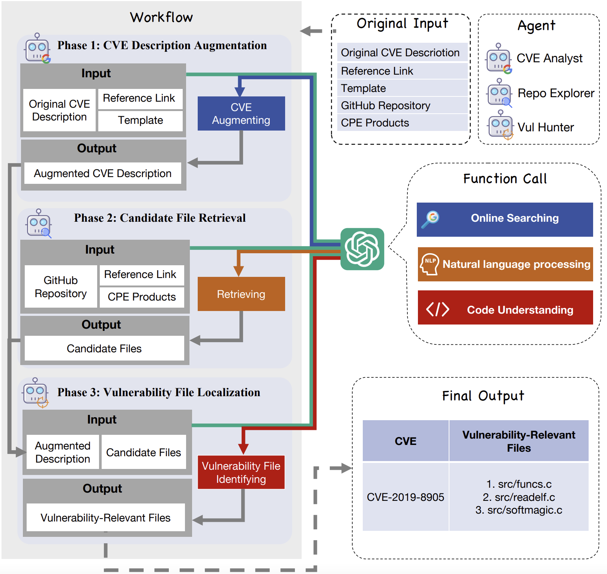
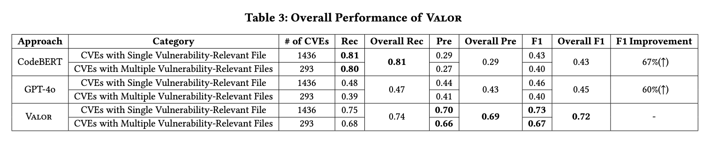
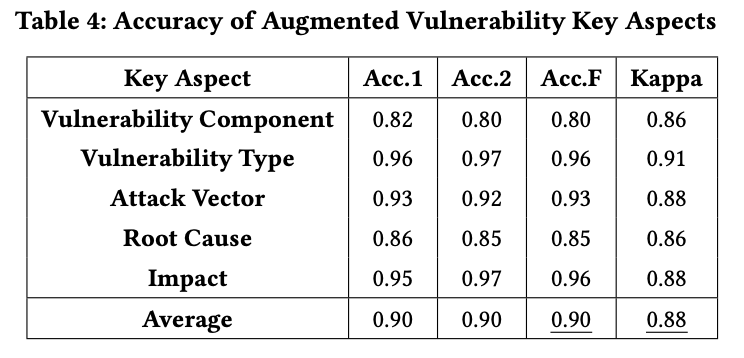
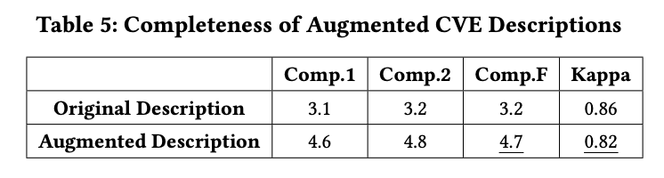
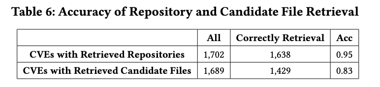
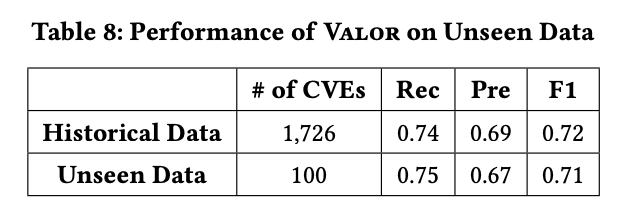

# Valor: Enhancing Vulnerability-Relevant File Discovery through an Agent-Based Framework

## Framework

## Code

### CVE Analyst
The CVE Analyst agent first enhances the original CVE descriptions by collecting supplementary information from external references and online sources, addressing gaps and incomplete details.

### Repo Explorer
The Repo Explorer agent identifies relevant open-source repositories and filters candidate files based on the augmented CVE descriptions, effectively narrowing the scope for localizing vulnerability-relevant files.

### VulHunter
The Vul Hunter agent performs precise localization by analyzing file hierarchies and conducting LLM-based semantic analysis to identify vulnerability-relevant files.

## Dataset
- **dataset.json**: The dataset contains 1729 CVEs in total, and each record includes repository, commits, and vulnerability_files.
- **cve_metadata**: full data can be downloaded from https://nvd.nist.gov/vuln/data-feeds#JSON_FEED

## Result

